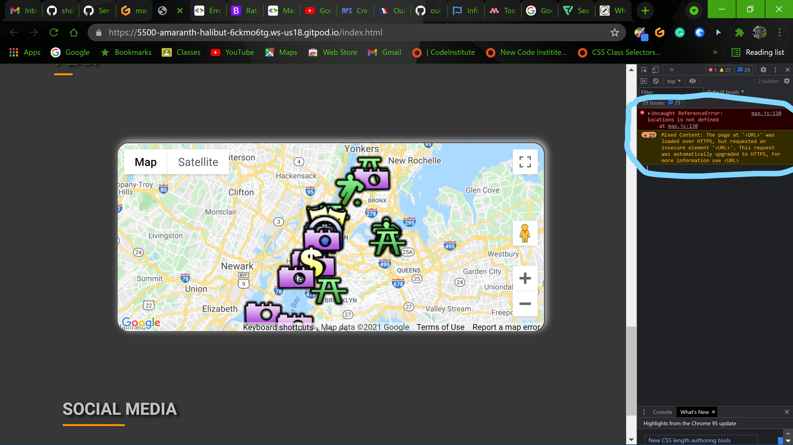
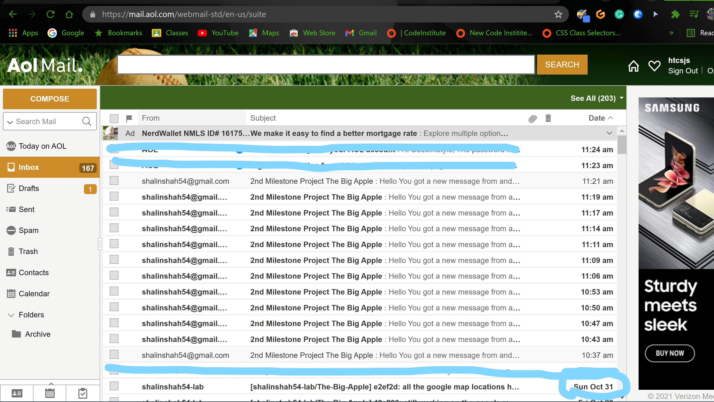
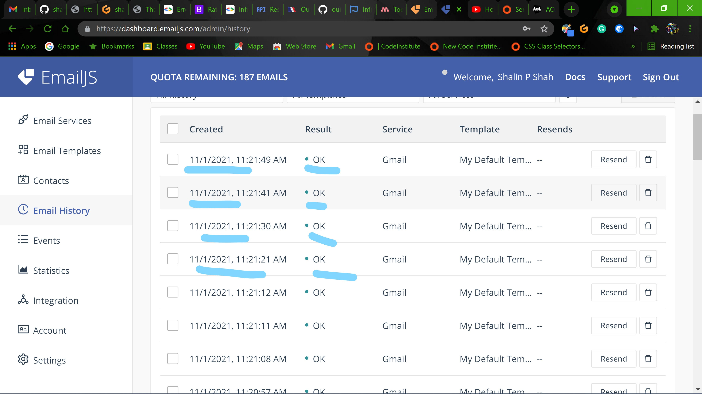

# The Big Apple

## Aim/ Purpose

NYC Travel site

This is my second milestone project, Joy Travels

Being the family business for over a century we are located in the heart of Manhattan, NY providing with the best travel experience a visitor can have.  As the clinet has lived all his life in the city providing with the full knowledge and information regarding the site.

Reason of this project is to put all what I learned and understood, the concepts of HTML, CSS and JavaScript put together a fully responsive static website.

I will run you through the steps to my project and putting all the efforts behind the design along with the user experience.

Thank You for all your help for which I was able to put together my very second project
[The Big Apple](https://shalinshah54-lab.github.io/The-Big-Apple/index.html)

## Table of Contents

- [User Experiencess](#user-experiences)
  - [User Stories](#user-stories)
  - [UX Framework](#ux-framework)
  - [Wireframes](#wireframes)
- [Existing Features](#existing-features)
- [Features to be added in future](#features-to-be-added-in-future)
- [Issues and Resolutions](#issues-and-resolutions)
- [Technoligies Used](#technologies-used)
  - [Languages used](#languages-used)
  - [Frameworks, Libraries, Programme and Resources Used](#frameworks-libraries-programme-and-resources-used)
- [Code Validation](#code-validation)
- [Testing](#testing)
- [Deployment](#deployment)
- [Credit](#credit)
- [Media](#media)
- [Acknowledgements](#acknowledgements)

## User Experiences

The inspiration and planning of the project was from different travel sites, UX sites and things that travelers love to do "enjoy the city they are in'. The website consist of travel based information about the big apple giving information about the NYC and places to see and attractions to visit. Our services provides with places to locate using a map and sites to see and pick from.

The planning of the project is broken into 5 planes;

- The Strategy Plane
- The Scope plane
- The Structure Plane
- The Skeleton Plane
- The Surface Plane

# **Strategy Plane**

The goal as a creator of my project is to act as a requirment of the travelers.

## _Creator Stories_

### _Creator Goals_ :-

- I wanted the project to b pleasing to the eyes at first glance.
- I wanted the project to be easily navigated on different platforms(mobile, tablets, laptops and desktops).
- I wanted easiy language text so the users can read without difficulties.
- I wanted to place a carousel slider to intrest the travelers to visit places just by seeing the images.
- I want all text and quotesto be properly placed and the shouldn't feel out of place as soon as they land on the page.

## _User Stories_

### _First Time Visitors_ :-

- As per the visitors, I want there experience to be user friendly.
- I want them to be easily navigate through the pages using the navigation bar.
- I want the user to navigate back to home page at anytime. 
- Being this somewhat a scroll down webpage with a link to contact page.
- I want the user experience to be same on all devices.
- I want to user to read the text without feeling bored.
- I want to images, text, therapy quotes and page presentation to be reinforcing to come back to the site.
- I want the visitor to contact the creator through the social links and contact page.
- I want them to give contact page for leaving information so we contact them with better deals and offer and come to visit us again.

### _Returning visitor goals_ :-

- As a returning visitor, I want to be able to get in contact with the creator or creators in some way, social links, or contact page using there email and message box to send it to the travel company for better deals, offers and new letters.
- As a returning visitor, I want to be able to cite the information or find out where the source of the information came from.

From my user stories, I am better able to come up with a conceptual idea of what the project needs in terms of features have more priority.
During my initial planning for the project, to make the project regarding a Travel Site I had to understand the travelers who come daily to the city, and setting up the travel place in the heart of manhattan and give the travelers best view of the city. So I decided to research and ask question to the travel agent for the locations, sites to visit. The City sites provide well informative script and gave a better ideas and helped me put all this together I was able to better understand the needs of this project.
I also would liked to know what travels are looking for and which places they are intrested to see most:

- How do you like to see the City.
- How would like to see the City.
- Do you know about different neigborhoods and places to see there.
- Do you like to recieve news letters via emails.
- If for any reason they need to contact where they can leave a msg.

# **Scope Plane**
## UX Framework
To Make the user experience more pleasing; In order to do so I started looking around asking questions to travel agents and going through the city websites, asking questions to the travelers personally with a site in place. After putting together all there ideas and researching I was able to put together a site which users would like to visit.

From the feedback of the users I came to know that they are more that the visitors love to see in short amount of time.

So I started planning using phases

#### _Phase - 1_

- A home page with a scroll down option. 
- Attractions which has a carousel slider with the places to see in the city.(Using JS)
- Plan section which has a Map of the New York City and the 4 boroghs with cluster Markers to     pin point the places. (using JS)
- A link on the main heading taking you to neighborhood page.
- Contact Us page (Email Sending by JS)

#### _Phase - 2_

- Section for direction using public transportation.(Using google API)
- Picking individual places to visit with a package and getting a quote on them.
- Weather on the page that gives travelers idea. (API)

#### _Phase - 3_

- Fully functional site (JavaScript knowledge)
- Web domine with a customer URL

Having a phased approach to the project allows users to feel surprised when a new version is deployed with extra elements and allows me time to collect feedback and better understand flaws with my initial design or development and to help me grow. Also allows me to implement new skills I have learned and build upon the initial design.

# **Structure Plane**

The first step for my research was visiting sites and knowing different layouts, elements in navigation bar, images, quotes, text, and colors.

### _Colors_ :

- Black
- Grey
- Shade of Orange
- White

Dark grey background to start with to make the images and text stand out more by giving the page the depth and drawing attention.

### _Typography_ :

- Reem Kufi
- Roboto

I used Roboto script throughout all the pages which looks simple  and also easy for anybody to read the text.

I also used Reem Kufi script in the heading of the information is provided to have the heading.

Navigation bar is fixed to the top as the page moves up and down where you can use the navigation bar anytime without having to scroll back up. The navigation bar changes to toggler with an toggler icon at 831px, which means any devices. It has an animation for the navlinks to appear with a delay using javascript and the burger symbol changes to an close symbol which works functionally.

Social Media links in the footer with a simple background color when hover over it will help user with attractive eye catching icons which upon clicking will direct them to the blank page regarding there individual sites.

Hero Image which is aligned vertically in the desktop view and horizontally in the laptop, tablet and mobile view. The images are well pixelated and properly arranged to give the page an attractive interaction with a good visual effect. On the home page at the attraction section there is a carousel slider with 5 images which slides upon loading the page every 2s interval. Other image on neighborhood page indicating the 5 boroghs with different images. 

There is a plan section which has a google map showing the place to see in and around the city with Cluster Markers.

The text is consistant throughout all the pages mostly consisting information about travel.

# **Skeleton Plane**
## Wireframes
Below is a link to the initial draft of the wireframe I created for the project and an initial conceptual idea of how everything would respond on different devices.

[TheBigAppleWireframe](https://www.figma.com/file/mygPQEtQG0flf6Nru9buxY/The-Big-Apple?node-id=0%3A1)

I also typed up all my pages beforehand to help me to proofread the content and fix the grammatical error. It also allowed me to plan my text, structure my paragraphs and condense text under subheadings.

There are some differences from the wireframes to the project,

## Existing Features
### Home Page
- Home page contains a heading with a quote **The Big Apple** and the content all in a container with a button that helps you ***plan*** the places to see by scrolling down to that section.
- The image on home page is centered of the page and navbar and logo on the left side of the page.
- All the navlinks have a hover effect once the mouse moves over it and at 831px the burger appears and onclick the navlinks have an animation of delay. And the burger changes to close sign with animation and javascript.
- All the main headings are underlined using shades of orange using CSS styling to have the topics stand out from the dark background.
- By clicking on the Plan Now button will scroll you down to the slider which has images and names of the places that visistor might like to see.
- Company name(logo) is a hyperlink which can bring you back to the home page at anytime.
### Attraction Section
- This section comes on the home page and as you scoll down you'll see the slider which displays all the images in a slide show which gets activated every 5s delay. 
- In this carosel there is an left and right arrows which mannually function the carosel in either direction. 
- There are buttons under the images which will jump to that image. 

### The Map Section
- There is a map section which displays the map of the NYC with attractions being marked by the icons. 
- These icons represent attractions, parks, sports, financial district, picnic area and the train station
- As you zoom in the places and area along with the icon is displayed properly.

### Footer Section
- The footer section has the links to the social media and are hyperlinks which are links to there related pages.
- The footer remains same across all the pages.
### Neighborhood Page

- On clicking on the Neighborhood link on the navbar on any pages which take you to the neighborhood page.
- This pages provides only information about different neighborhoods in NY. 
- There is an image related to the areas which has the information.

### Contact Page
- The contact page can be opened by clicking on the contact us on nav links.
- This page contains a small and simple form which contains name, email and messages and a submit button.
- By submitting your request an email is send to the admin with a message.
- After successfully sending the email the form is reseted.
- There are validations where the required fields are needed.
and will display red or green color. The form will not be submitted if the required field have not been added.

# **Surface Plane**

### Features to be added in future

- Weather updator across all the pages which can tell the weather according to the location.
- Places to stay and links to the hotel sites.
- Flight destination using API.
- I would like to add the location names in the map when vistiors hover over it.
- I would like to add that if the visitors like the caresol image and want to visit that place then just by clicking it they should be directed to the map where that image is located and its information should display.

### Issues and Resolutions

- The buttons onclick noticing a small box appearing in the background. Tried to fix that but still I see the same problem.
- The Carousel slides with a 2s delay and it has a little glitch which is noticed when the image is loading. There is a empty background between the sliding image. 
- Map has a difficulty with loading since the placement of the script tag was in the wrong place after fixing it now its appearing fine.
- The Map with icons display 
 -  seems too big tried reading through google map documentation but couldn't find the size for the icon. 
- With the contact page the email which is submitted properly and comes to my email but it doesn't display any message or give a conformation. I can see my email in my account.
 - 
 - 
- HTML validator indicates that the id of btn-carousel is used multiple times, tried fixing that but by changing the id tag to class tag the carousel slider don't function properly.
- There is diplacement of anchor tag in the heading section which are links to different sections get disrupted with different media queries.
- There is overflow of X noted on the media query 520px and lower fixed it by hidding that.
- There are CSS validation errors which I am aware about because I think I have duplicated them in different media queries.
- On the contact page with the Send message form input of text and errors are appearing. The script is also working, testing the email is being send but doing it from the site is not sending any email to the inbox. Tried to fix that with the help of my mentor also but still not able to understand the issue. 
- The images on the neighborhoood page gets distorted with different size on the page and gets adjusted with the media query.
- W3C Makrup Validator flagged up errors on improper placing the script tag. The tags were adjusted and porper placed.
- W3C CSS validator presented with alot of errors and seeing alot of duplicated classes trying to fix those.
- Social media links connected to the personal accounts.
- Map shows the cluster Markers and everything with placement of 20 marker(locations) for the traveller to see.
### _Technologies Used_ :

### Languages Used

- [HTML](https://www.w3schools.com/)

  - used as the basic building block for the project and to structure the content.

- [CSS](https://www.w3schools.com/)

  - used to style all the web content across the project.

- [JavaScript](https://www.w3schools.com/)
  - used to scripts across the project the correct way.

### Frameworks, Libraries, Programme and Resources Used  
- [Bootstrap 4](https://getbootstrap.com/)

  - Used as the main frame work to make the prject responsive.

- [JavaScript](https://www.javascript.com/)

  - used for the bootstrap navbar for extending collapse plugin and the contact us form by submitting.

- [jQuery](https://jquery.com/)

  - used with Bootstrap to make the navbar responsive.

- [Google Fonts](https://fonts.google.com/)

  - used to obtain the fonts linked in the header fonts used were Itim and Montserrat script.

- [Font Awesome](https://fontawesome.com/)

  - Used to obtain the social media lcon used in the footer and the icons used in the discription of the services and home page information.

- [Google Developer tools](https://developers.google.com/web/tools/chrome-devtools)

  - used primarily for fixing spacing issues finding bugs and testing responsiveness across the project.

- [EmailJs](https://www.emailjs.com/)
  - used to generate email for receiving msg and contact informaiton.

- [API](https://cloud.google.com/)
   - used to generate API key to get the google maps. 

- [Github](https://github.com/)

  - used to store code for the project after being pushed.

- [Git](https://git-scm.com/)

  - used for version control by utilizing the Gitpod terminal to commit to Git and Push to GitHub.

- [Gitpod](https://gitpod.io/)

  - used as the development envirnment. It helps to setup the code.

- [Figma](https://figma.com/)
  - Used to creat the wireframes for the project.
- [Stack Overflow](https://pt.stackoverflow.com/)
    - General resources.
- [Youtube](https://www.youtube.com/) 
  - General resources.
- Code Institute SLACK Community
  - General resources

### Code Validation

- The project was tested in the following browsers with success, Google Chrome, Microsoft Edge, Mozilla Firefox and Opera.
- Projects was manually tested on Samsung Note 9, Samsung S9, Samsung TabA and Hp laptop 11 inch screen and Asus laptop and Hp Desktops.
- Google Chrome Developer tools were used throughout the project to help me to test the responsiveness across devices.
- Google Chrome Developer tools used to emulate devices,
  - Moto G4
  - Galaxy S5
  - Pixel 2
  - Pixel 2 XL
  - iPhone 5/SE
  - iPhone 6/7/8
  - iPhone 6/7/8 plus
  - iPhone X
  - iPad
  - iPad pro
  - Galaxy Fold

I used W3C Markup Validator and W3C Validator to validate every page of the project to ensure there were no syntax errors in the project.

1. [Markup validator Result](https://validator.w3.org/nu/?doc=https%3A%2F%2Fshalinshah54-lab.github.io%2FThe-Big-Apple%2Findex.html)

   1. [home page Result](https://validator.w3.org/nu/?doc=https%3A%2F%2Fshalinshah54-lab.github.io%2FThe-Big-Apple%2Findex.html#textarea)

   1. [neighborhood page Result](https://validator.w3.org/nu/?doc=https%3A%2F%2Fshalinshah54-lab.github.io%2FThe-Big-Apple%2Findex.html#textarea)

   1. [contact page Result](https://validator.w3.org/nu/?doc=https%3A%2F%2Fshalinshah54-lab.github.io%2FThe-Big-Apple%2Findex.html#textarea)

2. [W3C CSS Validator Result](http://www.css-validator.org/validator#errors)

## Testing 

- Testing has an extented file attached [CLICK HERE TO VIEW](test.md)

User Story Testing

## _Deployment_

**GitHub**

This project is deployed using GitHub pages using the following process,

**Deplying a GitHub Repository**

1. In your Repository section, select the [GitHub Repository](https://github.com/shalinshah54-lab/The-Big-Apple) you wish to deploy.
1. In the top horizontal Menu, locate and click the _Settings_ link.
1. Inside the _Setting_ page, about almost at the end you'll see GitHub Pages Section.
1. Under Source , select the None tab and change it to the Main and click _Save_.
1. Finally once the page resets scroll back down to the Github Pages Section to seee the following message "Your site is ready to be published at (link to the GitHub Page Web Address). It can take time for the link to open your project initially, so please don't be worried if it down not load immediately.

**Forking the GitHub Repository**

You can fork a GitHub Repository to make a copy of the original repository to view or make changes without it affecting the repository in your GitHub account.

1. Find the GitHub repository.
1. At the top of the page to the right, under your account, click the _Fork_ button.
1. Your will now have a copy of the repository in your GitHub account.

**Making a Local Clone**

1. Find the GitHub Repository.
1. Click the Code button.
1. Copy the link shown.
1. In Gitpod, change the directory to the location you would like the cloned directory to be located.
1. Type git clone, and _paste_ the link you copied in step 3.
1. Press _Enter_ to have the local clone created.

## Credit

**Code :**

- Code Institute
  \*Thank you to Code Institute for all the videos and helping understand all the different types of mini projects with all the videos indifferent aspects.
- Bootstrap
  - Bootstrap library used throughtout the project mainly to make site responsive using the Bootstrap Grid System.
- Jquery Library used as needed on the site.  
- [Murach's HTML5 and CSS3](https://www.murach.com/shop/murachs-html5-and-css3-4th-edition-detail)
  - the reference guide helping in detail understanding of the HTML and CSS concepts.

## Media

  - Home page image :
   thanks to [Pexel](https://www.pexels.com/)[Unsplash](https://unsplash.com/)
  - Neighborhood page image :
   thanks to [Pexel](https://www.pexels.com/) images of the New York City and all the boroughs
  *Fully Responsive NavBar*
  - thanks to  for the navbar[Dev Ed Youtuber](https://www.youtube.com/channel/UClb90NQQcskPUGDIXsQEz5Q)  
## Acknowledgements

- Wikipedia
  - helping understand the concepts of different codes, elements, attributes, CSS styling.
- W3C school
  - helping with the HTML codes and CSS style and how the styling will look like with an example.
- Google
  - thanks to google for making search easier in every single field of coding.
  - thanks to google cloud Platform for the API for the maps.
- Academind (youtuber)
  - thanks to an youtuber for helping with bootstrap navbar making it responsive.
- Thanks to [Emailjs](https://www.emailjs.com/) for providing the link to email and API.  
-
  thanks to [tonny-reddington]from code institute (student) for sharing the code for email.js
  - I would like to thank Richard L LuciusVH student in Code Institute for the inspiration.
  - I would like to take few seconds to thank my mentor and instructors who have put together all the videos the materials for helping all the students throught this journey.

## Thank You
