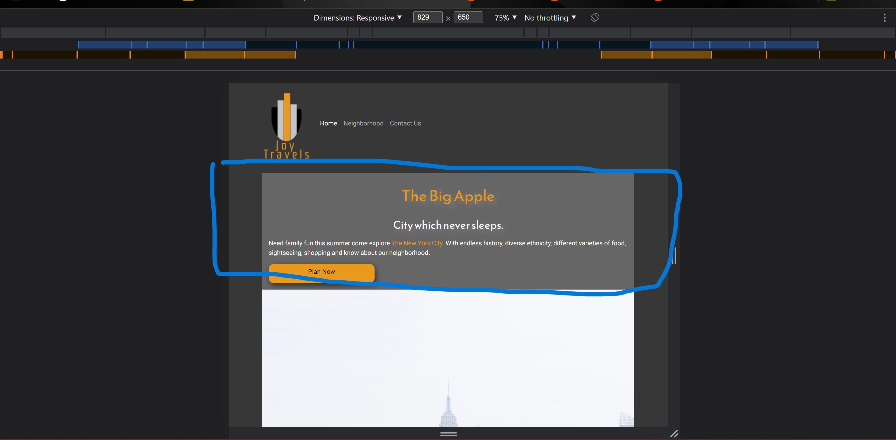
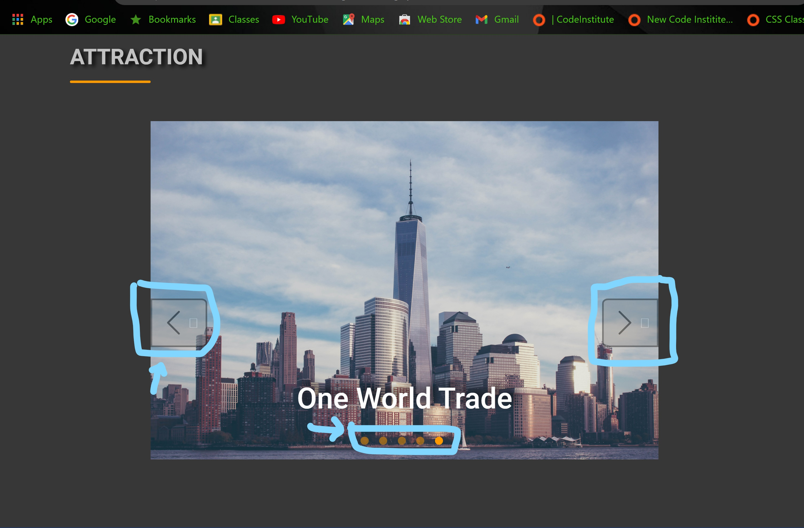
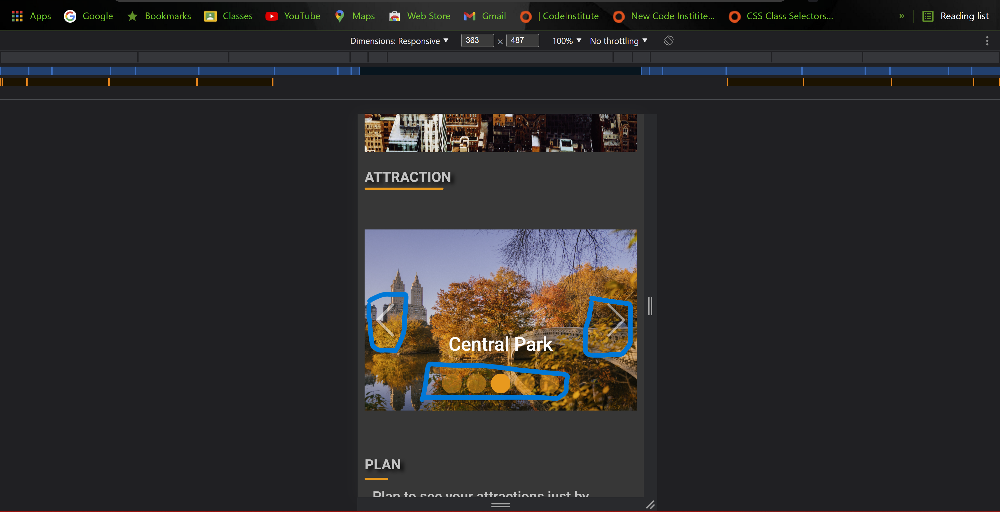
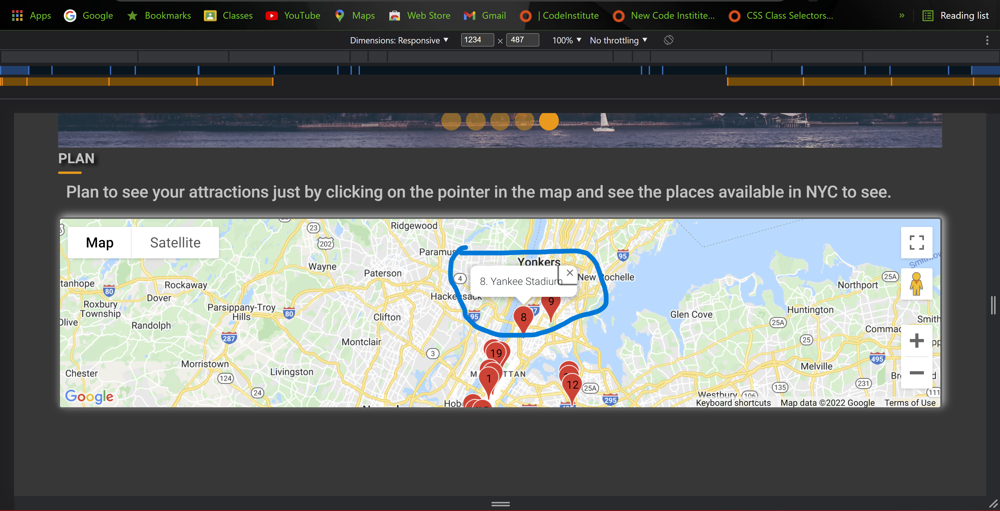

## Testing

### First Time User Goals

- As per the visitors, I want there experience to be user friendly.
- I want them to be easily navigate through the pages using the navigation bar.
- I want the user to navigate back to home page at anytime by clicking on the logo or the home navlink.
- Being this somewhat a scroll down webpage with a link to neighborhood and  contact page.
- As the user scrolls down they will come across the carosel with a slider and can manually operate it.
- Further scrolling down there is a Map area which is generated by the google map api and using the icon customizer to place then in the map for better view of attraction, train station, parks and sports places, etc.
- I want the user experience to be same on all devices.
- I want to user to read the text without feeling bored.
- I want to images, text, therapy quotes and page presentation to be reinforcing to come back to the site.
- On the neighborhood page there is a simple information about the areas to see and history about the neighborhood.
- I want the visitor to contact the creator through the social links and contact page.
- I want them to give contact page for leaving information so admin can contact them with better deals and offer and come to visit us again.

### Returning visitor goals

- As a returning visitor, I want to be able to get in contact with the creator or creators in some way, social links, or contact page using there email and message box to send it to the travel company for better deals, offers and new letters.
- As a returning visitor, I want to be able to cite the information or find out where the source of the information came from.
- As a returning visitor, I would like to see more features like the weather on the page to know how is the weather at the place I am visiting.
- I would like to purchase tickets online and not go to the office and pick up the ticket.

## Responsiveness
This project was required to be totally responsive, and mobile friendly therefore I decided to use Bootstrap as my main framework for it's cut down components that result in a clean, uncluttered view and minimize to add custom styles. Testing was done using dev-tool during build process, and also a final test of the entire website was done using Android phone and iphone to check its responsives.
- Page was responsive overall
- The card with information on the home page has been fixed on the top of the page which displays the information as soon as the user opens the site.
- There is a plan now button which can take the user to the attraction section where there is a carousel displaying the images of the different areas of New Yor City. 
- The responsiveness of the navbar changes to a slide nav at 768px and the menu appears.
- The carousel is responsive as the page loads will slide every 2s will change. And can be manually operated.
- The Map is responsive with the icon added for the users to specifically see the places.
- On the map the icons on hovering display location name and upon clicking it will appear an infowindow which will show the location name and can be closed by the close icon.
- The contact page has a form which can be filled out by a user and send it responsively to the admin and the user can be contacted back.

### Navbar

- The navbar is located on the top of all pages which contains three links, which are Home, Neighborhood and Contact Us.
- All the links are working properly  across all the pages.
- There is a logo of Joy Travels which is a direct link to the home page from any other pages.
- At 768px the navbar changes to a menu and on clicking on it will allow the nav links to appear by sliding the section down.
- The Nav links are displayed in the center of the page.
- On clicking the menu button once again will close the menu.

## Home page

- The home page is a scroll down page which can be easily accessed.
- The first section contain a hero image of the NYC with a darker background. 
- Over the hero image there is a card which gives a little content about the city and a plan button. On clicking on the plan button it will scroll down to the attraction page where the visitor can decide which place to visit in NY.
- The card with the content collapses as it changes the page size 

- This was debugged by changing the CSS `.card-body` which was used across all the media query at
     - 1920px
     - 1645px
     - 1140px
     - 928px
     - 768px
     - 414px
     - 380px
     - 360px

   this is fixed by placing the card on the top of the hero image. 

#### Attraction Section

- Once the page loads the carosel starts the slider which works using bootstrap JS and has 5s delay. There are manual buttons to move the carosel. 
- There is a left and right arrow button and there is a dot under the image which provides the vistitor to directly guide them to the perticular image.
- Issue is on larger screen the buttons appear on the image. But as the screen size changes the buttons collapse down in the lower part of the carosel.
- This is fixed by changing few bootstrap icons.

#### Plan Section
- On the home page under the attraction there is plan section which displays the map which was taken using google api which is credentialed and functioning properly.
- There are icon of a flag which shows the location for all the attractions in NYC and the other boros. On hovering over the icon it will display the name of that location.
- The user can zoom in and see the places closely where its located. 
- Before I had issues where there was only icons displaying and not the names.

- After fixing the bug 

- Now fixing it again to to make the map look better.

### Footer Section
- In the footer section there are social media links which are links to the personal account. 
- All the links have a hover effect which pops out with an animation and there color changes.
- Below that is a copy rights trade mark.
- This section is carried across all the pages.

### Neighborhood Page

- This page can be accessed by clicking on the nav link of neighborhood and take you to the page.
- This is a very simple page which contains images from all the boros and a brief information about the different boros.
- As the screen size is reduces there is alot of white space remaining before the footer section.

### Contact Page

- Contact page can be acessed by clicking on the contact us in the nav links. Once the page loads there is simple feedback form which is linked to email that can be send to the admin.
- This email function is generated by the [email.js](https://www.emailjs.com/).
- This is linked to the connected to the developers email id but in fucture can be connected to the admins email.
- Using emailjs the email formate can be customized as the admins likes and requirements. 
- The form contains required filled. which are full name, email and message.
- Once the user filled the form and submits it the admin recieves the email.
- Issue with this is I am not able to see the email being send on the page but in my inbox and the emailjs shows the email being send successfully.

- The form being a required field tells the user if the field is empty to fill it up.

### Code Validation

- The project was tested in the following browsers with success, Google Chrome, Microsoft Edge, Mozilla Firefox and Opera.
- Projects was manually tested on Samsung Note 9, Samsung S9, Samsung TabA and Hp laptop 11 inch screen and Asus laptop and Hp Desktops.
- Google Chrome Developer tools were used throughout the project to help me to test the responsiveness across devices.
- Google Chrome Developer tools used to emulate devices,
  - Moto G4
  - Galaxy S5
  - Pixel 2
  - Pixel 2 XL
  - iPhone 5/SE
  - iPhone 6/7/8
  - iPhone 6/7/8 plus
  - iPhone X
  - iPad
  - iPad pro

I used W3C Markup Validator and W3C Validator to validate every page of the project to ensure there were no syntax errors in the project.

1. [Markup validator Result](assets/images/markup_validation.png)

   1. [home page Result](assets/images/index_validation.png)

   1. [neighborhood page Result](assets/images/neigborhood_validation.png)

   1. [contact page Result](assets/images/contact_validation.png)

2. [W3C CSS Validator Result](assets/images/css_validation.png)

3. JavaScript Validation
    1. [JSHint emails](assets/images/emailjs_validation.png)
    2. [JSHint maps](assets/images/mapjs_validation.png)

